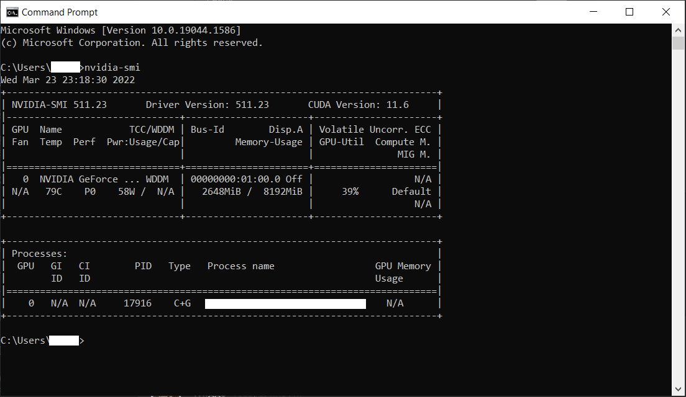
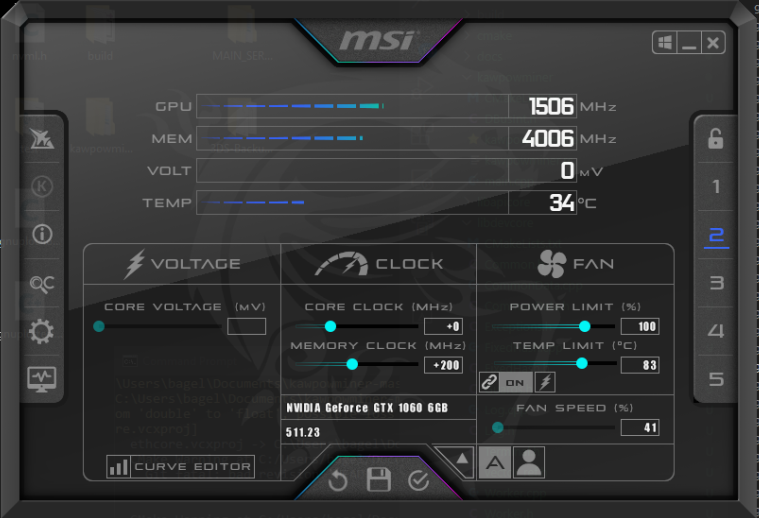
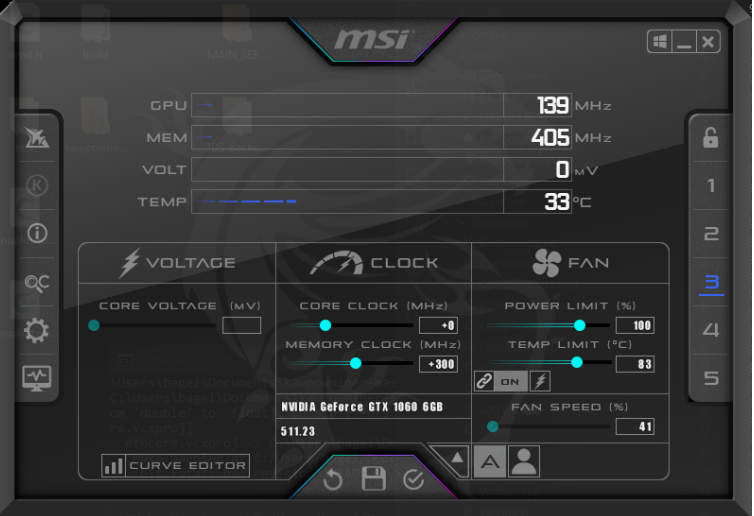
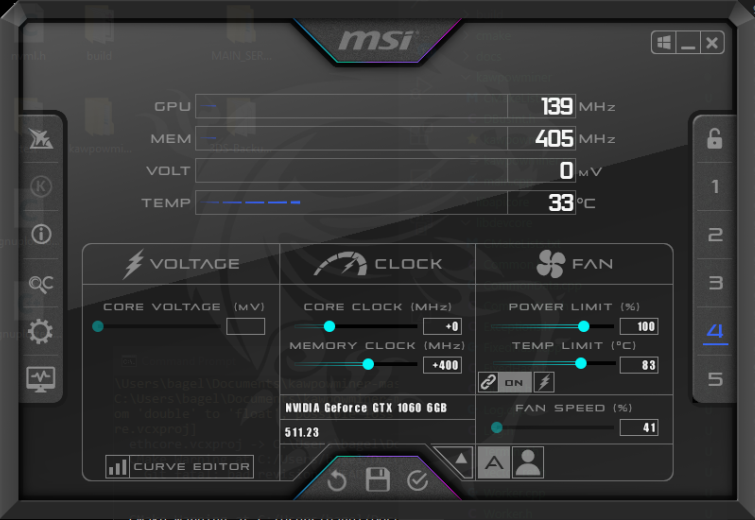
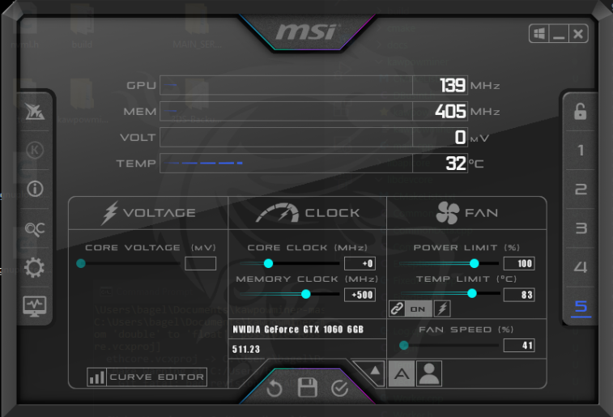
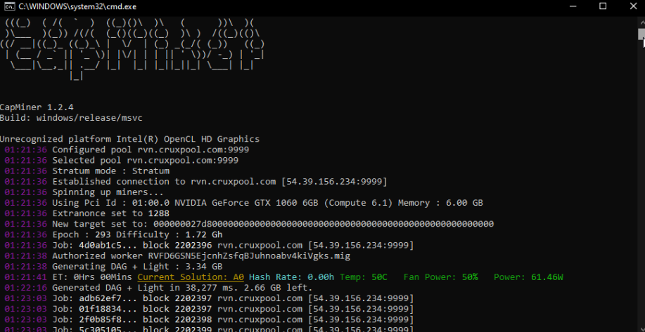
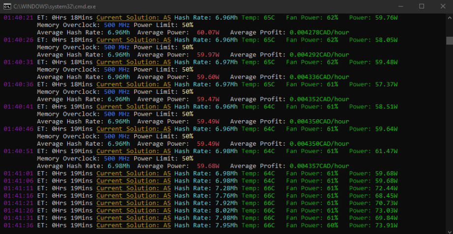
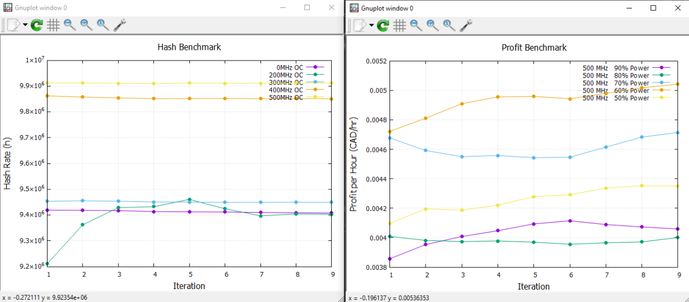

# CapMiner

> Ravencoin miner for Windows supporting NVIDIA cards 

## About

CapMiner is a proof-of-work GPU miner dedicated for [Ravencoin](https://ravencoin.org/). Currently, the project supports mining on Windows OS with NVIDIA GPUs only. This project is forked from RavenCommunity's kawpowminer and implements a benchmarking system to maximize profit.


## Tables of Contents
* [Requirements](#requirements)
* [Building](#building)
* [How to Run](#how-to-run)
    * [Running with Source Code](#running-with-source-code)
    * [Running with Executable Release](#running-with-executable-release)
    * [Connecting to a Pool](#connecting-to-a-pool)
* [APIs Used](#apis-used)
* [F.A.Q.](#faq)

## Requirements
1. Install [MSI Afterburner](https://www.msi.com/Landing/afterburner/graphics-cards) and configure profiles seen in next section.
2. Disable [User Access Control](https://www.lifewire.com/disable-uac-in-windows-10-5113191) for your system. This is intended to remove the prompt that is issued when MSI Afterburner sets new profiles and helps the miner application run fluidly.
3. Ensure you have nvidia-smi by opening commandline, type nvidia-smi, and press enter. Output should look something like below.
4. Install [GNUPlot](http://www.gnuplot.info/) Homepage -> Download -> Primary download site on SourceForge -> latest (i.e. 5.4.3)
5. **MAKE SURE TO ENABLE "Add application directory to your PATH environment variable" during the installation of GNUPlot.**

**nvidia-smi example:** <br />


Depending on the type of release chosen, extra steps may be required. That being said, the executable variant is simple to implement on any system fullfilling the requirements.

| Requirements |                                          |
| ------------ | ---------------------------------------- |
| OS           | Windows 10                               |
| GPU          | GEFORCE GTX 10xx+                        |
| Drivers      | [Latest Recommended by GeForce Experience](https://www.nvidia.com/en-us/geforce/drivers/) |

Any CUDA issues may be resolved by installing the latest [CUDA Toolkit](https://developer.nvidia.com/cuda-downloads).

## MSI Afterburner
By default, MSI Afterburner allows the creation of 5 profiles. You must set the first profile as your stock settings. For the other 4 profiles, change the Memory clock speed to the following.

**Profile 1:** <br />


**Profile 2:** <br />


**Profile 3:** <br />


**Profile 4:** <br />


**Profile 5:** <br />


## Installation

As of now, CapMiner only supports deployment on **Windows** systems supplied with GPUs from NVIDIA's mainline releases, such as the *10xx line*, *20xx line*, and *30xx line*.

### Windows
[Releases][Releases]

The latest builds for windows can be found in the [Releases] section as an executable or source download. Individuals may choose either option to run CapMiner. Explanations on building the source code can be found in the next section.

## Building

If you choose the source download over the executable release, you **must** follow these steps in order to compile a build and use CapMiner. There are additional requirements as well if this route is chosen. First, place the downloaded source code to a convient location such as *C:\Users\Me\CapMiner*.

1. Install [Visual Studio Community 2019](https://visualstudio.microsoft.com/vs/older-downloads/) (ex// version 16.11) 
   **With C++ Cmake Tools for Windows**
2. Install [Strawberry Perl](https://strawberryperl.com/) to C:\Perl
3. Install [Git](https://git-scm.com/download/win)
4. Open "Developer Command Prompt for VS 2019"
5. Enter the following:
```
cd C:\Users\CHANGE_THIS_DIRECTORY\CapMiner-master
git init
git submodule update --init --recursive
mkdir build
cd build
cmake -G "Visual Studio 16 2019" -A X64 -H. -Bbuild -DETHASHCUDA=ON -DAPICORE=ON ..
cd build
cmake --build . --config Release
```

## How to Run 
### Running with Source Code

If you have opted for building over installing the executable release, confirm that the build has been successful by checking that **capminer.exe** has been created in the following location:
```
cd C:\Users\CHANGE_THIS_DIRECTORY\CapMiner-master\build\build\CapMiner\Release
```
Here create a .txt file and rename it to "start.bat". Right click the .bat file and click edit. Paste the following code into the file and change the first line to have your wallet and worker name.
```
CapMiner.exe -P stratum+tcp://<wallet>.worker@rvn.cruxpool.com:9999
%~dp0\..\..\..\..\ps\msiProfile1.bat
```

### Running with Executable Release
If you have downloaded the executable release, locate the existing start.bat file and replace <wallet> with your own mining address to start earning for yourself. Feel free to replace "worker" to name your miner something meaningful. Run the start.bat to begin mining.

### Connecting to a Pool

1. Navigate to **capminer.exe** directory:
```
cd C:\Users\CHANGE_THIS_DIRECTORY\CapMiner-master\build\build\CapMiner\Release
```
2. Run the start.bat file after having changed the wallet to reflect your own.
   
3. If successful, CapMiner will initialize and begin to run as shown:
   
**Miner spinning up:** <br />

   
**Benchmark start:** <br />

   
**Benchmark complete and miner resumes as usual:** <br />

   
**Graphs of benchmark data open as bench completes:** <br />


### Closing the program
If you wish to automatically return to stock GPU settings, on the CapMiner commandline press **ctrl+c ctrl+c ctrl+c** in a sequence. This will exit CapMiner and launch a script to return to profile 1 'stock settings' in MSI Afterburner.
   
## APIs and Sofware Used
### Hunter
Dependency manager running within CMake during configuration step. Downloads and builds all dependencies from source. This is to make the project independent of system libraries.
### CMake
Used for C/C++ projects to control the software compilation process with configuration files and to set up libraries and project files making the project independent of the compiler/build environment.
### Boost 
General C++ source library with various functionality including IO timers and threads.
### Cable
Cable is a set of CMake modules and scripts containing common patterns used in CMake-based C++ projects.
### CLI11
CLI11 is a command line parser for C++11 and beyond that provides a rich feature set with a simple and intuitive interface.
### OpenSSL
OpenSSL is a robust, commercial-grade, full-featured Open Source Toolkit for the Transport Layer Security (TLS) protocol formerly known as the Secure Sockets Layer (SSL) protocol.
### JsonCPP
JsonCpp is a C++ library that allows manipulating JSON values, including serialization and deserialization to and from strings.
   
## F.A.Q.
### How does CapMiner improve upon kawpowminer?
CapMiner implements an automatic benchmark system that starts upon app launch. In an average time of 17 minutes, the program cycles different combinations of memory clock speed and power limit. The combination that generates the highest profit is selected and the seetings are saved for use.
### How do I redo the benchmark?
Go to the path where the main .exe is located and delete the benchmark.txt file. Doing this and re-running the application normally will prompt the app to benchmark once again.
### What if I have an AMD card?
While kawpowminer supports both NVIDIA and AMD GPUs, CapMiner's benchmarking system is only compatible with NVIDIA series cards.
### I exited CapMiner without using ctrl+c 3 times, how do I go back to my GPUs stock settings?
If this happens don't worry, all you need to do is open MSI Afterburner and select Profile 1. In the set up for this program, the stock settings had to be saved to the first profile.
### How do I review the benchmarked graphs after closing them?
The graph pngs will always be located in the main folder containing the .exe file.
### Why does the program open and close a blue screen periodically?
To change the power limit of the system, Powershell must run in admin mode. The program does this specifically only for benchmarking and will no longer perform this once benchmark is completed.
   
[Releases]: https://github.com/capminer/capminer/releases
